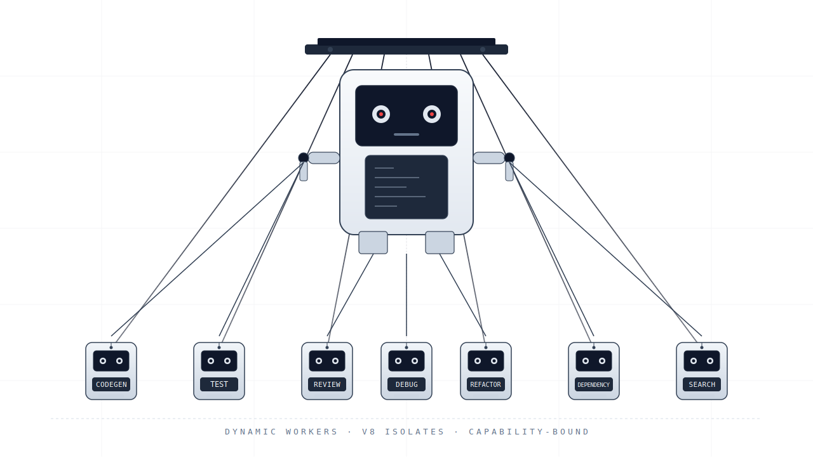

# Agent Orchestrator

An AI agent orchestration platform for autonomous software development — code generation, testing, code review, refactoring, and debugging — that decomposes a task into a dependency graph of agents and runs them **concurrently** with self-healing, human review, and full cost tracking.

The orchestration **core is platform-agnostic**. A ports-and-adapters design keeps the scheduling logic runtime-neutral, so the same engine runs in two places:

- **Cloudflare edge runtime** — each agent executes in its own [Dynamic Worker](https://developers.cloudflare.com/dynamic-workers/) (sandboxed V8 isolate, egress firewall, millisecond starts, 100+ concurrent agents).
- **Local Node runtime** — the same orchestrator runs on your machine with **no Cloudflare account**, using in-process agent runners, an in-memory state store, and an egress-guarded `fetch`.

The **LLM backend is pluggable** too: Anthropic, OpenAI, DeepSeek, Ollama, or any OpenAI-compatible / self-hosted endpoint — selected by configuration, not code.



---

## How It Works

1. **You submit a task** — a description, target repo, and agent type.
2. **The orchestrator decomposes it** — a `codegen` task spawns CodeGen → Test → Review subtasks with dependency ordering.
3. **Agents run concurrently** — bounded by a semaphore (rate-limit safe). On Cloudflare they run in sandboxed Dynamic Workers with scoped file system, Git, LLM, and search bindings; locally they run as in-process runners. Agents never see credentials.
4. **Results aggregate** — when all subtasks pass, the task enters a human review gate. Failures self-heal with retries + error context.
5. **You approve** — the orchestrator creates a GitHub PR with the agent's changes.

```
POST /tasks → Orchestrator core → [ Cloudflare Dynamic Workers | Local Node runners ] → Human Review → GitHub PR
```

---

## Features

| Feature | Description |
|---|---|
| **Platform-Agnostic Core** | Ports-and-adapters design; the same engine runs on Cloudflare or a local Node runtime |
| **Pluggable LLM Providers** | Anthropic, OpenAI, DeepSeek, Ollama, or any OpenAI-compatible/self-hosted endpoint — chosen by config |
| **Concurrent Multi-Agent** | Dependency-aware wave scheduling bounded by a counting semaphore (rate-limit safe) |
| **6 Agent Types** | CodeGen, Test, Review, Refactor, Debug, Dependency |
| **Sandboxed Execution** | On Cloudflare, each agent runs in an isolated V8 isolate with an egress firewall |
| **Capability-Based Security** | Agents only access resources they're explicitly given (Cap'n Web RPC) |
| **Credential Injection** | GitHub PATs and API keys injected at the gateway/egress layer, invisible to agents |
| **Self-Healing** | Failed agents automatically retry with error context (exponential backoff) |
| **Human-in-the-Loop** | Review gate — approve, reject, or request revisions before PR creation |
| **Real-Time Streaming** | WebSocket (edge) / SSE (local) endpoints for live agent logs |
| **Cost Tracking** | Per-task token usage, CPU time, and dollar estimates |
| **Agent Memory** | KV-backed persistent memory for coding conventions and patterns |
| **Multi-Repo** | Per-repo credential scoping and branch isolation |

---

## Quick Start

There are two ways to run the orchestrator. Pick whichever fits — the HTTP API
and orchestration behavior are the same.

| Runtime | Command | Needs Cloudflare? | Agent execution |
|---|---|---|---|
| **Local Node** | `npm run dev:local` | No | In-process runners + in-memory state |
| **Cloudflare edge** | `npm run dev` (wrangler) | Yes | Sandboxed Dynamic Workers + Durable Objects |

### Prerequisites

- Node.js >= 18
- An LLM API key — Anthropic, OpenAI, DeepSeek, or a local Ollama / self-hosted endpoint
- GitHub Personal Access Token (for repo file/Git operations)
- **Cloudflare account** — only for the edge runtime (Paid plan for Durable Objects + KV)

### Local Node runtime (no Cloudflare account)

Runs the full orchestrator on your machine using in-process agent runners, an
in-memory state store, and an egress-guarded `fetch`.

```bash
# Install dependencies
npm install

# Configure via environment (see LLM Providers below)
export LLM_PROVIDER=anthropic
export LLM_API_KEY=sk-ant-...
export LLM_MODEL=claude-sonnet-4-20250514
export GITHUB_PAT=ghp_...

# Start the local server (hot reload)
npm run dev:local
# → http://127.0.0.1:8787

# Verify
curl http://127.0.0.1:8787/health
```

### Cloudflare edge runtime

```bash
# Install dependencies
npm install

# Create .dev.vars with your secrets
cat > .dev.vars << 'EOF'
ANTHROPIC_API_KEY=sk-ant-...
OPENAI_API_KEY=sk-...
GITHUB_PAT=ghp_...
EOF

# Start the wrangler dev server
npm run dev
# → http://localhost:8787

# Verify
curl http://localhost:8787/health
```

### LLM Providers

The active model backend is selected by configuration and implemented behind a
single `LlmProvider` port (`src/providers/llm/`). No application code changes are
needed to switch providers.

| Provider | `LLM_PROVIDER` | Notes |
|---|---|---|
| Anthropic | `anthropic` | Claude models |
| OpenAI | `openai` | GPT models (OpenAI-compatible) |
| DeepSeek | `deepseek` | OpenAI-compatible endpoint |
| Ollama | `ollama` | Local models; requires `LLM_BASE_URL` (e.g. `http://localhost:11434/v1`) |
| Self-hosted | `openai-compatible` | Any OpenAI-compatible server; requires `LLM_BASE_URL`. `vllm`, `lmstudio`, `together`, `groq` are also recognized ids |

On the Cloudflare runtime the LLM binding (`src/bindings/llm.ts`) delegates to
the same provider layer, so per-task `provider` / `model` selection works there
too. See [docs/architecture.md](docs/architecture.md#pluggable-llm-providers).

### Local Development with Docker

If you'd rather not install Node/wrangler on the host:

```bash
cp .env.example .dev.vars   # fill in your API keys
docker compose -f docker-compose.yml -f docker-compose.dev.yml up
# → http://localhost:8787  (hot reload enabled via source bind-mount)
```

See [docs/docker.md](docs/docker.md) for the full Compose guide, including
deploying to Cloudflare from a pinned toolchain image.

### Production Deployment

```bash
# Create KV namespaces (copy IDs into wrangler.jsonc)
wrangler kv namespace create AGENT_MEMORY
wrangler kv namespace create REPO_CREDENTIALS

# Set secrets
wrangler secret put ANTHROPIC_API_KEY
wrangler secret put OPENAI_API_KEY
wrangler secret put GITHUB_PAT

# Deploy
npm run deploy

# Verify
curl https://agent-orchestrator.<your-subdomain>.workers.dev/health
```

---

## Usage

### Create a Task

```bash
curl -X POST https://your-worker.workers.dev/tasks \
  -H "Content-Type: application/json" \
  -d '{
    "tasks": [{
      "description": "Add rate limiting middleware to the Express API",
      "agentType": "codegen",
      "repo": {
        "owner": "myorg",
        "repo": "my-api",
        "branch": "agent/rate-limiter",
        "baseBranch": "main",
        "files": {
          "src/middleware/auth.ts": "...existing code..."
        }
      }
    }]
  }'
```

### Poll Status

```bash
curl https://your-worker.workers.dev/tasks/<task-id>
```

### Stream Logs

On the Cloudflare edge runtime, `/tasks/:id/stream` is a WebSocket:

```javascript
const ws = new WebSocket("wss://your-worker.workers.dev/tasks/<task-id>/stream");
ws.onmessage = (e) => console.log(JSON.parse(e.data));
```

On the local Node runtime the same path is Server-Sent Events:

```bash
curl -N http://127.0.0.1:8787/tasks/<task-id>/stream
```

### Approve for PR

```bash
curl -X POST https://your-worker.workers.dev/tasks/<task-id>/review \
  -H "Content-Type: application/json" \
  -d '{ "taskId": "<task-id>", "decision": "approve" }'
```

### Check Costs

```bash
curl https://your-worker.workers.dev/usage
```

---

## CI/CD Integration

### GitHub Actions Deploy Pipeline

Create `.github/workflows/deploy.yml`:

```yaml
name: Deploy

on:
  push:
    branches: [main]
  pull_request:
    branches: [main]

jobs:
  typecheck:
    runs-on: ubuntu-latest
    steps:
      - uses: actions/checkout@v4
      - uses: actions/setup-node@v4
        with:
          node-version: "20"
          cache: "npm"
      - run: npm ci
      - run: npm run typecheck

  deploy:
    needs: typecheck
    if: github.ref == 'refs/heads/main'
    runs-on: ubuntu-latest
    steps:
      - uses: actions/checkout@v4
      - uses: actions/setup-node@v4
        with:
          node-version: "20"
          cache: "npm"
      - run: npm ci
      - run: npx wrangler deploy
        env:
          CLOUDFLARE_API_TOKEN: ${{ secrets.CLOUDFLARE_API_TOKEN }}
```

### Agent-Driven CI Repair

Agents can also be triggered by CI failures to automatically diagnose and fix broken builds:

```yaml
  auto-fix:
    if: failure()
    needs: test
    runs-on: ubuntu-latest
    steps:
      - run: |
          curl -X POST https://your-worker.workers.dev/tasks \
            -H "Content-Type: application/json" \
            -d '{
              "tasks": [{
                "description": "Fix CI failure: ${{ steps.test.outputs.error }}",
                "agentType": "debug",
                "repo": {
                  "owner": "${{ github.repository_owner }}",
                  "repo": "${{ github.event.repository.name }}",
                  "branch": "agent/fix-${{ github.run_id }}",
                  "baseBranch": "${{ github.head_ref }}",
                  "files": {}
                }
              }]
            }'
```

See [docs/deployment.md](docs/deployment.md) for the full CI/CD guide including staging environments and smoke tests.

---

## API Endpoints

| Method | Path | Description |
|---|---|---|
| `GET` | `/health` | Health check |
| `POST` | `/tasks` | Create tasks |
| `GET` | `/tasks/:id` | Get task status |
| `POST` | `/tasks/:id/review` | Submit review decision |
| `WS` / `SSE` | `/tasks/:id/stream` | Real-time log stream (WebSocket on edge, SSE on local) |
| `GET` | `/usage` | Cost tracking |

Full API documentation: [docs/api-reference.md](docs/api-reference.md)

---

## Project Structure

```
.
├── wrangler.jsonc                 # Cloudflare Worker configuration
├── package.json                   # Dependencies and scripts
├── tsconfig.json                  # TypeScript for the Worker source (strict)
├── tsconfig.node.json             # TypeScript for the local Node runtime (src/local)
├── tsconfig.test.json             # TypeScript for tests (Jest types)
├── Dockerfile                     # Multi-stage: dev / typecheck / prod deploy
├── docker-compose*.yml            # Base + dev + prod Compose overrides
├── .env.example                   # Template for .dev.vars and .env
├── docs/
│   ├── architecture.md            # System design, ports & adapters, data flow
│   ├── platform-agnostic-feasibility.md  # Feasibility deep-dive (Task 1)
│   ├── technical-summary.md       # Summary of the platform-agnostic conversion
│   ├── adr/                       # Architectural Decision Records (0001–0004)
│   ├── research-brief.md          # Dynamic Workers platform research
│   ├── api-reference.md           # Full HTTP API documentation
│   ├── agents.md                  # Agent types and tool API
│   ├── security.md                # Security model and egress control
│   ├── deployment.md              # Local dev, production, and CI/CD
│   ├── docker.md                  # Docker Compose usage and deploy workflow
│   └── configuration.md           # Wrangler config and tuning guide
├── src/
│   ├── index.ts                   # Cloudflare orchestrator Worker (edge entry)
│   ├── types.ts                   # Shared type definitions
│   ├── env.d.ts                   # Generated environment types
│   ├── state.ts                   # TaskManager + CostTracker DOs (Cloudflare)
│   ├── observability.ts           # DynamicWorkerTail + LogSession DO (Cloudflare)
│   ├── gateway.ts                 # HttpGateway egress control (Cloudflare)
│   ├── core/                      # ── Runtime-neutral orchestration core ──
│   │   ├── ports.ts               # StateStore + AgentRuntime interfaces (the "ports")
│   │   ├── orchestrator.ts        # Scheduling, concurrency, self-heal, review flow
│   │   ├── state-machine.ts       # Pure transition table + cost aggregation
│   │   ├── decompose.ts           # Task → subtask dependency graph (pure)
│   │   ├── semaphore.ts           # Counting semaphore bounding concurrent agents
│   │   ├── memory-state-store.ts  # In-memory StateStore (local/testing)
│   │   └── id.ts                  # Runtime-neutral id generation
│   ├── providers/llm/             # ── Pluggable LLM provider layer ──
│   │   ├── types.ts               # LlmProvider port
│   │   ├── registry.ts            # provider id → adapter factory
│   │   ├── anthropic.ts           # Anthropic adapter
│   │   ├── openai-compatible.ts   # OpenAI / DeepSeek / Ollama / self-hosted
│   │   ├── pricing.ts             # Per-model cost estimation
│   │   └── retry.ts               # Backoff + jitter
│   ├── runtime/                   # ── Runtime adapters ──
│   │   ├── egress.ts              # EgressPolicy: allowlist + credential injection
│   │   └── local.ts               # LocalRuntime (AgentRuntime for Node)
│   ├── local/                     # ── Local Node HTTP server ──
│   │   ├── main.ts                # Executable entry (npm run dev:local)
│   │   ├── server.ts              # REST API + SSE log streaming
│   │   ├── config.ts              # Env-driven configuration
│   │   └── log-hub.ts             # In-process log fan-out
│   ├── agents/
│   │   ├── source.ts              # Agent source code registry (Cloudflare)
│   │   ├── runners.ts             # In-process codegen/test/review runners (local)
│   │   ├── codegen.ts             # CodeGen Agent (reference)
│   │   ├── test.ts                # Test Agent (reference)
│   │   └── review.ts              # Review Agent (reference)
│   └── bindings/                  # Cloudflare RPC bindings
│       ├── filesystem.ts          # FileSystem RPC binding
│       ├── git.ts                 # Git RPC binding
│       ├── llm.ts                 # LLM RPC binding (delegates to providers/llm)
│       ├── search.ts              # CodeSearch RPC binding
│       └── memory.ts              # Memory RPC binding
└── examples/
    ├── crypto-payments/           # Platform-agnostic payment service (Stripe/PayPal/Coinbase/Mock)
    ├── fastapi-crypto-terminal/   # FastAPI orchestrator client example
    └── task-ui/                   # Task submission UI
```

---

## Documentation

| Document | Description |
|---|---|
| [Architecture](docs/architecture.md) | System design, ports & adapters, component map, data flow, state machine |
| [Technical Summary](docs/technical-summary.md) | Overview of the platform-agnostic conversion + crypto-payments example |
| [Platform-Agnostic Feasibility](docs/platform-agnostic-feasibility.md) | Deep-dive: coupling points, target architecture, migration strategy |
| [ADRs](docs/adr/) | Architectural Decision Records — runtime, LLM, payment, and state/observability abstractions |
| [Research Brief](docs/research-brief.md) | Cloudflare Dynamic Workers deep research findings |
| [API Reference](docs/api-reference.md) | Full HTTP/WebSocket API documentation |
| [Agents](docs/agents.md) | Agent types, tool API interfaces, how to add new agents |
| [Security](docs/security.md) | Sandboxing, egress control, credential separation, threat model |
| [Deployment](docs/deployment.md) | Local dev, production deploy, CI/CD pipelines |
| [Docker](docs/docker.md) | Containerized dev server and pinned deploy toolchain via Docker Compose |
| [Configuration](docs/configuration.md) | Wrangler config, secrets, tuning guide, multi-environment |

---

## Examples

| Example | Description |
|---|---|
| [crypto-payments](examples/crypto-payments/) | A platform-agnostic, modular payment service that switches between **Stripe, PayPal, Coinbase Commerce, or Mock** via one env var — the same ports-and-adapters pattern applied to payments. Webhook signatures are verified before events are trusted; money is handled in integer minor units. |
| [fastapi-crypto-terminal](examples/fastapi-crypto-terminal/) | A FastAPI client that submits tasks to the orchestrator. |
| [task-ui](examples/task-ui/) | A minimal UI for creating tasks and watching live logs. |

---

## Scripts

| Script | Command | Description |
|---|---|---|
| `dev:local` | `npm run dev:local` | Start the local Node runtime (hot reload, no Cloudflare) |
| `start:local` | `npm run start:local` | Start the local Node runtime (no watch) |
| `dev` | `npm run dev` | Start the Cloudflare (wrangler) dev server |
| `deploy` | `npm run deploy` | Deploy to Cloudflare |
| `typecheck` | `npm run typecheck` | Type-check the Worker source |
| `typecheck:node` | `npm run typecheck:node` | Type-check the local Node runtime (`src/local`) |
| `typecheck:test` | `npm run typecheck:test` | Type-check the test suite |
| `test` | `npm test` | Run unit + integration tests |
| `test:unit` | `npm run test:unit` | Run unit tests |
| `test:integration` | `npm run test:integration` | Run integration tests |
| `test:coverage` | `npm run test:coverage` | Run tests with coverage (80% gate) |
| `types` | `npm run types` | Regenerate `env.d.ts` from wrangler config |
| `tail` | `npm run tail` | Stream live production logs |

---

## License

Copyright (c) 2026 David Brown. All rights reserved. David Brown is the sole owner and copyright holder of this software.

This project is dual-licensed:

| License | Use Case |
|---|---|
| **Community License** (Apache 2.0 + Commons Clause) | Non-commercial use, personal projects, research, education, evaluation |
| **Commercial License** | Production commercial use, SaaS deployment, redistribution in commercial products |

The Community License grants full Apache 2.0 freedoms (including an explicit patent grant) with the Commons Clause restriction that prohibits selling the software or offering it as a paid service. All contributions are assigned to the copyright holder under the Contributor License Agreement in the LICENSE file.

For commercial licensing inquiries, contact David Brown via [GitHub](https://github.com/papismurf).

See [LICENSE](LICENSE) for the full terms.
